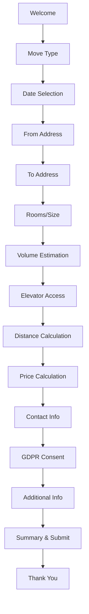
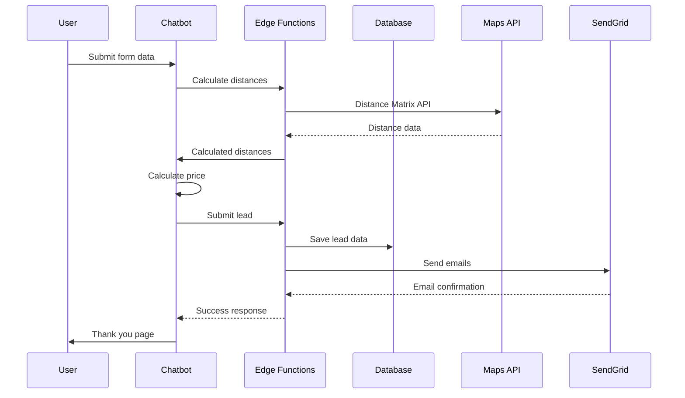

# Smartflytt System Architecture

Production-grade moving quote chatbot built with modern web technologies and enterprise security practices.

## 🏗️ System Overview

Smartflytt is a conversational AI system that guides users through a structured flow to collect moving requirements and generate preliminary quotes. The system prioritizes security, scalability, and user experience.

### Core Capabilities
- **Intelligent Chatbot**: Multi-step conversational flow in Swedish
- **Price Calculation**: Real-time quote generation with distance-based pricing
- **Lead Management**: Admin dashboard with role-based access control
- **Email Integration**: Automated notifications via SendGrid
- **Analytics Tracking**: Comprehensive user behavior and conversion tracking

## 🎯 Architecture Principles

- **Security First**: JWT authentication, RLS policies, input validation
- **Type Safety**: Strict TypeScript configuration throughout
- **Performance**: Edge functions, caching, lazy loading
- **Accessibility**: WCAG 2.1 compliance, semantic HTML
- **Observability**: Structured logging, error tracking, analytics

## 📋 Technology Stack

### Frontend
- **React 18** with TypeScript (strict mode)
- **Vite** for build tooling and HMR
- **TailwindCSS** + shadcn/ui for styling
- **React Hook Form** + Zod for validation
- **React Query** for server state management
- **next-themes** for dark/light mode

### Backend
- **Supabase** (PostgreSQL + Auth + Edge Functions)
- **Row Level Security (RLS)** for data access control
- **SendGrid** for transactional emails
- **Google Maps Distance Matrix API** for route calculation

### Development & Deployment
- **Vitest** + React Testing Library for testing
- **ESLint** + Prettier for code quality
- **GitHub Actions** for CI/CD
- **Lovable** platform for hosting and deployment

## 🗄️ Data Architecture

### Database Schema

```sql
-- User roles and authentication
CREATE TABLE user_roles (
    id UUID PRIMARY KEY DEFAULT gen_random_uuid(),
    user_id UUID REFERENCES auth.users(id),
    role app_role NOT NULL DEFAULT 'user',
    created_at TIMESTAMPTZ DEFAULT NOW(),
    updated_at TIMESTAMPTZ DEFAULT NOW()
);

-- Lead capture and management
CREATE TABLE leads (
    id UUID PRIMARY KEY DEFAULT gen_random_uuid(),
    submission_type submission_type NOT NULL,
    lead_quality lead_quality DEFAULT 'medium',
    lead_score INTEGER CHECK (lead_score >= 0 AND lead_score <= 100),
    status lead_status DEFAULT 'new',
    
    -- Contact info (validated)
    name TEXT NOT NULL CHECK (LENGTH(name) BETWEEN 1 AND 100),
    email TEXT NOT NULL CHECK (email ~* '^[A-Za-z0-9._%+-]+@[A-Za-z0-9.-]+\.[A-Za-z]{2,}$'),
    phone TEXT NOT NULL CHECK (public.is_valid_swedish_phone(phone)),
    
    -- Move details
    move_date DATE CHECK (move_date >= CURRENT_DATE),
    from_address JSONB NOT NULL,
    to_address JSONB NOT NULL,
    volume NUMERIC(5,2) CHECK (volume > 0),
    
    -- Calculated data
    distance_data JSONB,
    price_calculation JSONB,
    chat_transcript JSONB DEFAULT '[]'::JSONB,
    
    created_at TIMESTAMPTZ DEFAULT NOW(),
    updated_at TIMESTAMPTZ DEFAULT NOW()
);

-- Sales audit trail
CREATE TABLE lead_sales_audit (
    id BIGSERIAL PRIMARY KEY,
    lead_uuid TEXT REFERENCES leads(id) ON DELETE CASCADE,
    partner_price INTEGER CHECK (partner_price >= 0),
    platform_commission INTEGER CHECK (platform_commission >= 0),
    sold_at TIMESTAMPTZ DEFAULT NOW(),
    sold_by TEXT
);
```

### Security Policies

```sql
-- Anonymous users can submit leads
CREATE POLICY "Anonymous can insert leads" ON leads
    FOR INSERT TO anon WITH CHECK (true);

-- Admins can manage all leads
CREATE POLICY "Admins can manage leads" ON leads
    FOR ALL TO authenticated
    USING (public.has_role(auth.uid(), 'admin'))
    WITH CHECK (public.has_role(auth.uid(), 'admin'));
```

## 🔄 Application Flow

### Chatbot Conversation Flow



### Data Processing Pipeline



## 🛡️ Security Architecture

### Authentication & Authorization
- **JWT Tokens**: All edge functions require valid JWT
- **Role-Based Access**: Admin role required for dashboard access
- **Session Management**: Automatic token refresh and validation

### Input Validation
- **Client-Side**: Zod schemas with Swedish locale validation
- **Server-Side**: Database constraints and validation functions
- **SQL Injection**: Parameterized queries via Supabase client

### Data Protection
- **Encryption**: TLS 1.3 for all communications
- **PII Handling**: Minimal data collection, GDPR compliant
- **Rate Limiting**: Edge function request throttling
- **CORS**: Strict origin allowlist (no wildcards)

## ⚡ Performance Optimizations

### Frontend
- **Code Splitting**: Route-based lazy loading
- **Bundle Optimization**: Tree shaking, compression
- **Caching**: React Query for server state
- **Image Optimization**: WebP format, lazy loading

### Backend
- **Edge Functions**: Global distribution via Supabase
- **Database Indexing**: Optimized query performance
- **Connection Pooling**: Managed by Supabase
- **Caching**: Distance calculation results cached

## 📊 Monitoring & Observability

### Logging Strategy
```typescript
// Structured logging with context
logger.info('Price calculation completed', {
  component: 'PriceCalculator',
  userId: 'user-123',
  volume: 25,
  totalPrice: 28800,
  latencyMs: 150
});
```

### Analytics Events
- `chatbot_step_completed`: Track user progression
- `price_calculated`: Monitor calculation accuracy
- `lead_generated`: Measure conversion rates
- `form_abandoned`: Identify drop-off points

### Error Tracking
- **Error Boundaries**: React component error isolation
- **Edge Function Errors**: Structured error logging
- **Performance Monitoring**: Response time tracking

## 🧪 Testing Strategy

### Unit Tests (Vitest)
- Business logic functions (price calculation)
- Validation schemas and utilities
- Service layer methods

### Integration Tests
- Complete chatbot flows
- API client error handling
- Database operations

### Accessibility Testing
- Keyboard navigation
- Screen reader compatibility
- Color contrast validation

## 🚀 Deployment Architecture

### Environments
- **Development**: Local with Supabase local dev
- **Staging**: Lovable preview environment
- **Production**: Lovable production + custom domain

### CI/CD Pipeline
```yaml
# .github/workflows/ci.yml
name: CI/CD Pipeline
on: [push, pull_request]
jobs:
  test:
    runs-on: ubuntu-latest
    steps:
      - uses: actions/checkout@v4
      - name: Setup Node.js
        uses: actions/setup-node@v4
        with:
          node-version: '18'
      - name: Install dependencies
        run: npm ci
      - name: Run tests
        run: npm test
      - name: Build application
        run: npm run build
```

### Edge Function Deployment
- Automatic deployment via Supabase CLI
- Environment-specific configuration
- Rollback capability

## 📈 Scalability Considerations

### Database Scaling
- Read replicas for reporting queries
- Partitioning for large lead tables
- Archive strategy for old data

### Frontend Scaling
- CDN distribution
- Progressive Web App features
- Service worker caching

### API Scaling
- Rate limiting per user/IP
- Request queue management
- Circuit breaker patterns

## 🔧 Development Guidelines

### Code Organization
```
src/
├── components/          # Reusable UI components
│   ├── chatbot/        # Chatbot-specific components  
│   ├── admin/          # Admin dashboard components
│   └── ui/             # Base UI components (shadcn)
├── services/           # API clients and business logic
├── utils/              # Pure utility functions
├── types/              # TypeScript definitions
├── data/               # Constants and static data
└── test/               # Test utilities and setup
```

### Best Practices
- **Type Safety**: Strict TypeScript, no `any` types
- **Error Handling**: Graceful degradation, user-friendly messages
- **Performance**: Bundle size monitoring, lazy loading
- **Accessibility**: Semantic HTML, ARIA attributes

## 🔮 Future Enhancements

### Technical Improvements
- **Real-time Updates**: WebSocket connections for live data
- **Offline Support**: PWA with offline form submission
- **Multi-language**: i18n support beyond Swedish
- **AI Enhancements**: More intelligent chatbot responses

### Business Features
- **Partner Integration**: API for moving company partners
- **Calendar Integration**: Scheduling system
- **Document Upload**: Photo-based volume estimation
- **Payment Processing**: Online booking and payment

---

*This architecture document is maintained as part of the Smartflytt codebase and should be updated with any significant system changes.*